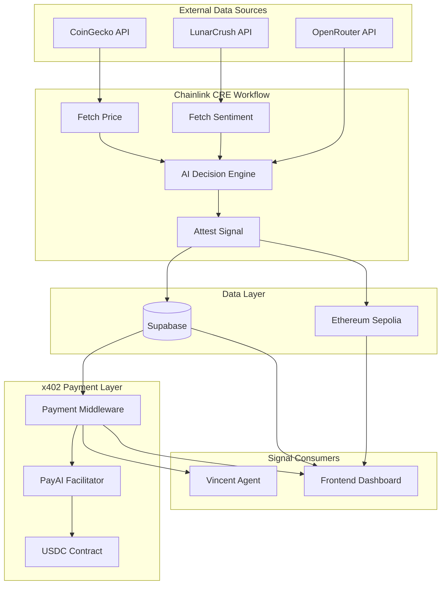
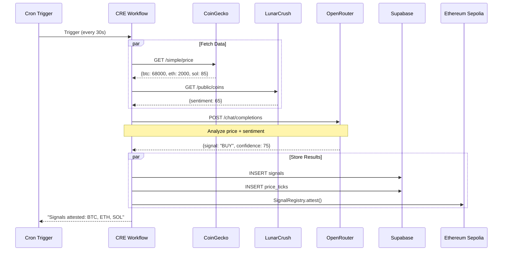
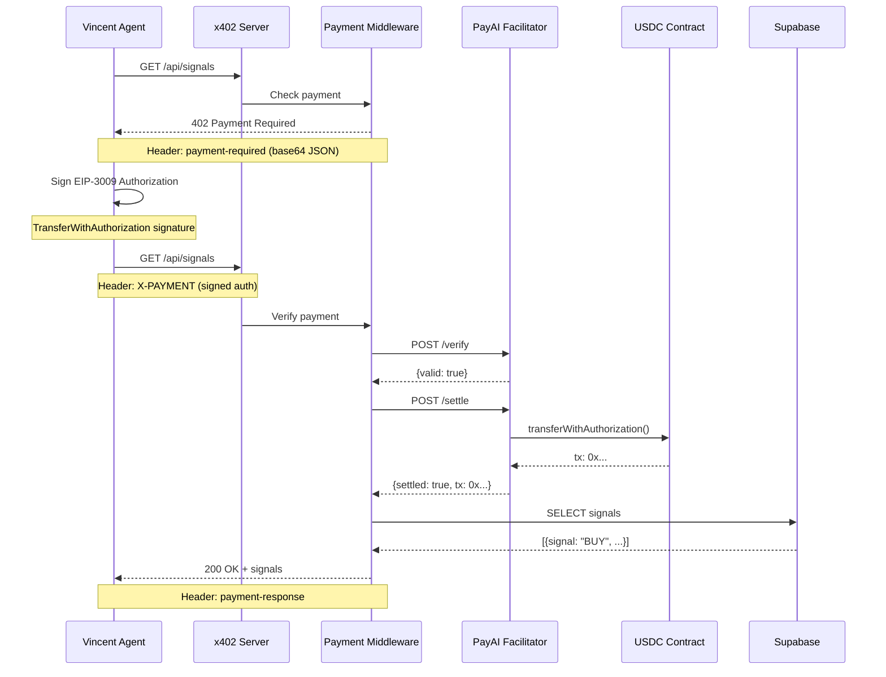
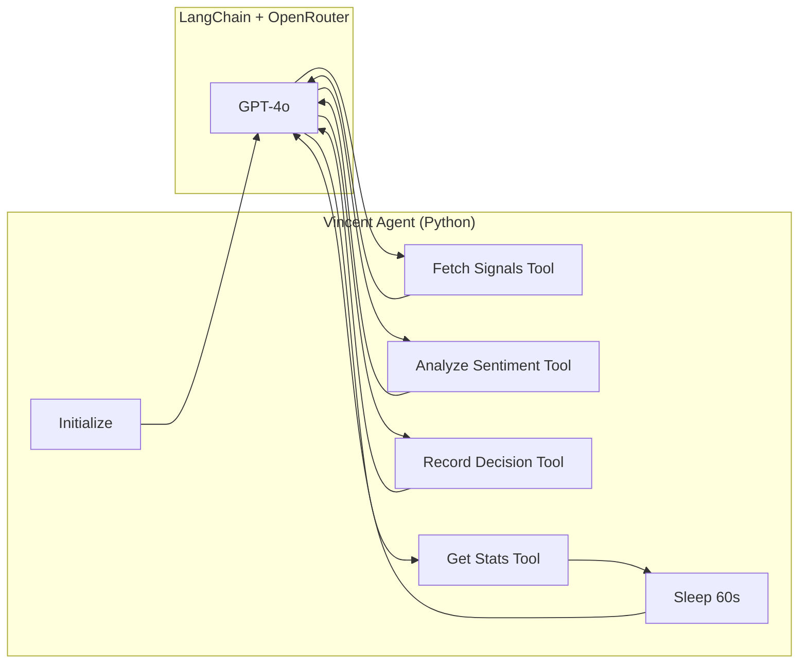
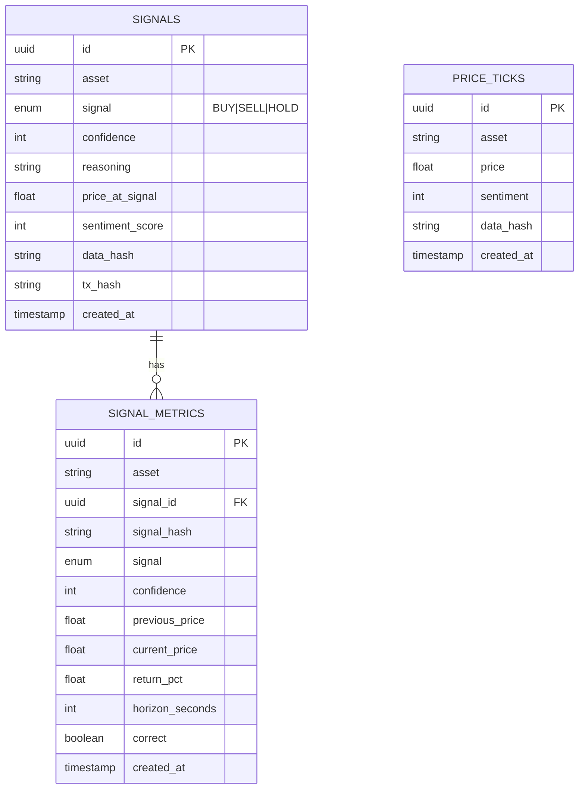
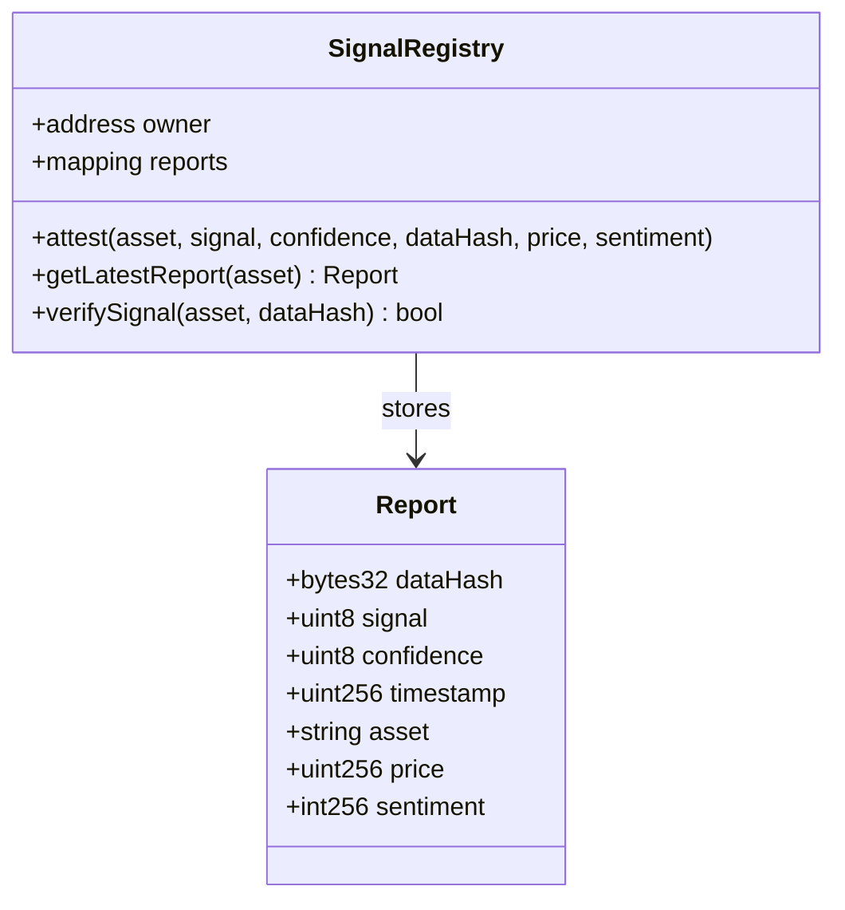
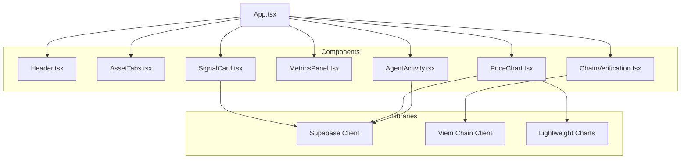
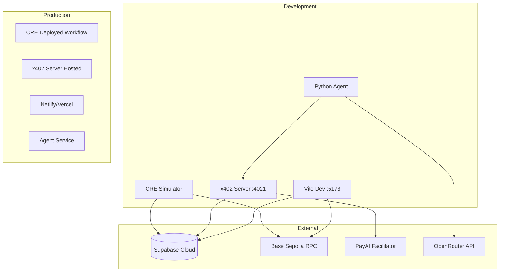
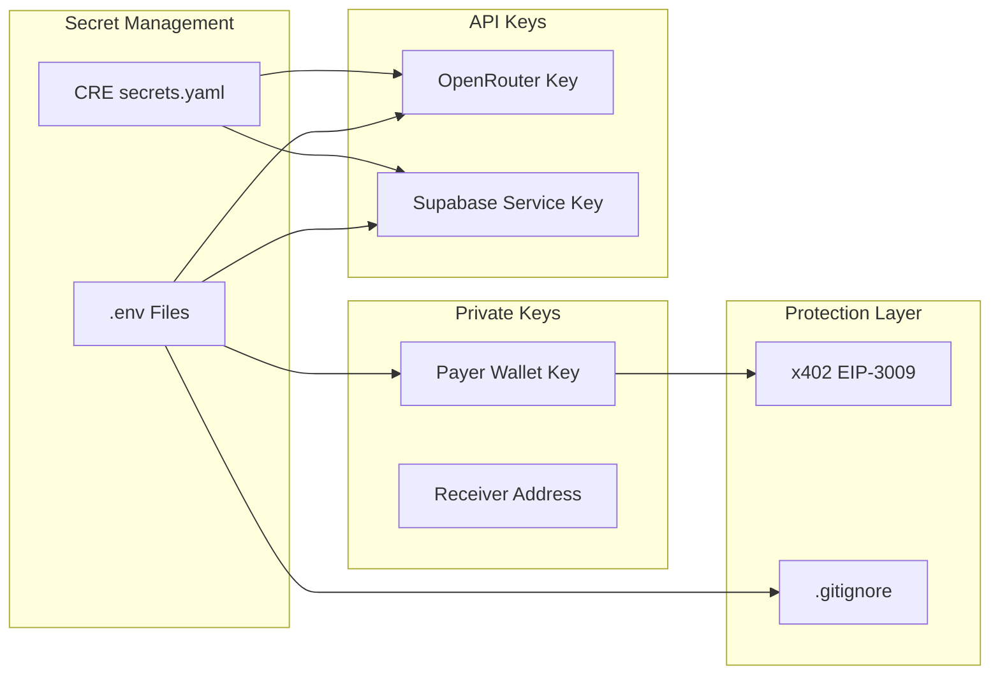
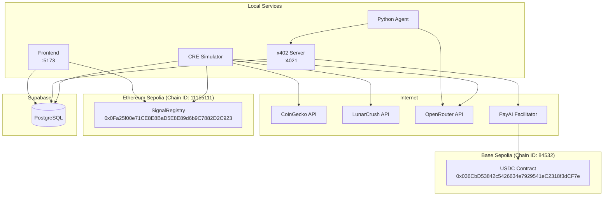

# Vincent Architecture

Detailed architecture diagrams for the Vincent autonomous trading signal system.

## System Overview

## CRE Workflow Detail

## x402 Payment Flow

## Agent Decision Loop

## Data Models

## Smart Contract Architecture

## Frontend Component Tree

## Deployment Architecture

## Security Model

## Network Topology

---

## Key Addresses

| Contract | Network | Address |
|----------|---------|---------|
| USDC | Base Sepolia | `0x036CbD53842c5426634e7929541eC2318f3dCF7e` |
| SignalRegistry | Ethereum Sepolia | `0x0Fa25f00e71CE8E8BaD5E8E89d6b9C7882D2C923` |

## Key Endpoints

| Service | Endpoint | Description |
|---------|----------|-------------|
| x402 Server | `GET /api/signals` | Protected signal endpoint ($0.01 USDC) |
| x402 Server | `GET /api/paid-demo` | Demo endpoint with payment |
| PayAI | `POST /verify` | Verify payment signature |
| PayAI | `POST /settle` | Settle payment on-chain |
