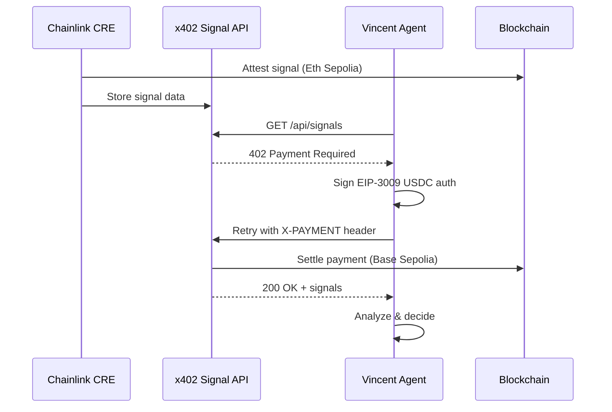

# Vincent

**Autonomous AI Trading Signals powered by Chainlink CRE + x402 Payments**

[](https://hack.chain.link)
[](https://docs.chain.link/cre)
[](https://x402.org)

> **Submission for [Convergence: A Chainlink Hackathon](https://hack.chain.link) — CRE & AI Track**

---

## What is Vincent?

Vincent is an **autonomous AI trading signal system** that demonstrates real-world machine-to-machine commerce. An AI agent independently discovers, pays for, and consumes trading signals—all without human intervention.

### The Problem

Traditional API monetization requires:
- API keys and account management
- Subscription billing and invoicing
- Manual integration for each consumer
- No support for autonomous AI agents

### The Solution

Vincent combines two powerful technologies:

| Technology | Role |
|------------|------|
| **Chainlink CRE** | Generates verifiable trading signals using off-chain data (prices, sentiment) with on-chain attestation |
| **x402 Protocol** | Enables instant, permissionless pay-per-request API access using USDC |

**Result:** AI agents can autonomously discover, pay for, and consume CRE-generated data—no API keys, no subscriptions, no human intervention.

---

## How It Works



### Key Flows

**1. Signal Generation (CRE Workflow)**
- Fetches real-time prices from CoinGecko
- Fetches social sentiment from LunarCrush  
- AI (GPT-4o via OpenRouter) analyzes data and generates BUY/SELL/HOLD signal
- Signal attested on-chain (Ethereum Sepolia) with data hash for verification
- Signal stored in Supabase for API access

**2. Signal Monetization (x402)**
- API protected by x402 payment middleware
- Returns HTTP 402 with payment requirements
- Accepts EIP-3009 USDC authorization signatures
- PayAI facilitator settles payment on Base Sepolia
- Signal data returned after successful payment

**3. Autonomous Consumption (AI Agent)**
- LangChain agent with custom tools
- Automatically detects 402 responses
- Signs and submits USDC payment
- Analyzes received signals
- Records trading decisions

---

## Product Features

| Feature | Description |
|---------|-------------|
| **Multi-Asset Signals** | BTC, ETH, SOL with real-time price and sentiment data |
| **AI-Powered Decisions** | GPT-4o analyzes market conditions and generates signals with confidence scores |
| **On-Chain Verification** | Every signal attested on Ethereum Sepolia with verifiable data hash |
| **Pay-Per-Request** | $0.01 USDC per API call—no subscriptions, no API keys |
| **Autonomous Agent** | Python agent using LangChain that pays and consumes signals automatically |
| **Live Dashboard** | React frontend with TradingView charts, signal history, and agent activity monitor |
| **World ID Gating** | Proof-of-personhood gate via World ID before x402 signal access |

---

## Chainlink CRE Integration

Vincent uses Chainlink's Compute Runtime Environment (CRE) to create a **trustless signal generation pipeline**:

```typescript
// CRE Workflow: signal-attestator/signal-attestator/main.ts

// 1. Fetch external data
const price = await httpClient.get(coingeckoUrl);
const sentiment = await httpClient.get(lunarcrushUrl);

// 2. AI decision
const signal = await httpClient.post(openrouterUrl, {
  messages: [{ role: "user", content: analysisPrompt }]
});

// 3. On-chain attestation
await evmClient.call(signalRegistry, "attest", [
  asset, signal, confidence, dataHash, price, sentiment
]);

// 4. Off-chain storage
await httpClient.post(supabaseUrl, signalData);
```

**Why CRE?**
- Runs on Chainlink's battle-tested node infrastructure
- Deterministic execution with verifiable outputs
- Native support for HTTP calls, EVM transactions, and cross-chain operations
- Production-ready for institutional use cases

---

## Project Structure

```
vincent/
├── signal-attestator/          # Chainlink CRE Workflow
│   └── signal-attestator/
│       ├── main.ts             # Core workflow logic
│       ├── config.staging.json # Multi-asset config
│       └── workflow.yaml       # CRE deployment settings
├── x402-server/                # Payment Gateway
│   └── index.js                # Express + x402 + PayAI
├── agent/                      # Autonomous AI Agent
│   ├── agent.py                # LangChain/LangGraph agent
│   └── run.sh                  # Launch script
├── frontend/                   # React Dashboard
│   └── src/App.tsx             # Live signals + charts
├── contracts/                  # Smart Contracts
│   └── src/SignalRegistry.sol  # On-chain attestation
└── ARCHITECTURE.md             # Detailed diagrams
```

---

## Quick Start

### Prerequisites

- [Chainlink CRE CLI](https://docs.chain.link/cre)
- Node.js 18+ / Python 3.10+

### Run All Services

```bash
# 0. Configure env
# - x402-server/.env: add WORLD_ID_APP_ID
# - frontend/.env: add VITE_WORLD_ID_APP_ID
# - agent/.env: add WORLD_ID_ADMIN_SECRET to auto-fetch latest token

# 1. CRE Workflow (generates signals every 30s)
cd signal-attestator
cre workflow simulate ./signal-attestator -T staging-settings

# 2. x402 Server (payment gateway on :4021)
cd x402-server && npm install && node index.js

# 3. AI Agent (autonomous consumer)
cd agent && ./run.sh

# 4. Frontend (dashboard on :5173)
cd frontend && npm install && npm run dev
```

---

## World ID + CRE Track Integration

Vincent participates in the **World ID + CRE sponsor track** by enforcing **proof-of-personhood** before
any paid signal access.

**Flow:**
1. User verifies with **World ID (IDKit)** in the frontend.
2. The frontend posts proof to **/api/world-id/verify**.
3. The x402 server verifies proof off-chain (World ID API) and issues a short-lived token.
4. Requests to **/api/signals** or **/api/paid-demo** must include `x-world-id-token`.
5. The agent can auto-fetch the latest token from **/api/world-id/token** using a shared admin secret.

This demonstrates World ID verification off-chain within CRE-connected infrastructure, enabling access on
chains where World ID is not natively available.

---

## Deployed Contracts

| Contract | Network | Address |
|----------|---------|---------|
| SignalRegistry | Ethereum Sepolia | `0x0Fa25f00e71CE8E8BaD5E8E89d6b9C7882D2C923` |
| USDC (x402) | Base Sepolia | `0x036CbD53842c5426634e7929541eC2318f3dCF7e` |

---

## Tech Stack

| Layer | Technology |
|-------|------------|
| **Workflow** | Chainlink CRE, TypeScript |
| **On-Chain** | Ethereum Sepolia, Foundry, Viem |
| **Payments** | x402 Protocol, EIP-3009, PayAI Facilitator, Base Sepolia USDC |
| **AI** | OpenRouter (GPT-4o), LangChain, LangGraph |
| **Frontend** | React 19, TailwindCSS 4, TradingView Lightweight Charts |
| **Database** | Supabase (PostgreSQL) |

---

## Links

- **Hackathon:** [hack.chain.link](https://hack.chain.link)
- **CRE Docs:** [docs.chain.link/cre](https://docs.chain.link/cre)
- **x402 Protocol:** [x402.org](https://x402.org)
- **Architecture:** [ARCHITECTURE.md](./ARCHITECTURE.md)

---

## License

MIT

---

**Built for [Convergence: A Chainlink Hackathon](https://hack.chain.link) — CRE & AI Track**

## Links

- **Hackathon:** [hack.chain.link](https://hack.chain.link)
- **CRE Docs:** [docs.chain.link/cre](https://docs.chain.link/cre)
- **x402 Protocol:** [x402.org](https://x402.org)
- **Architecture:** [ARCHITECTURE.md](./ARCHITECTURE.md)

