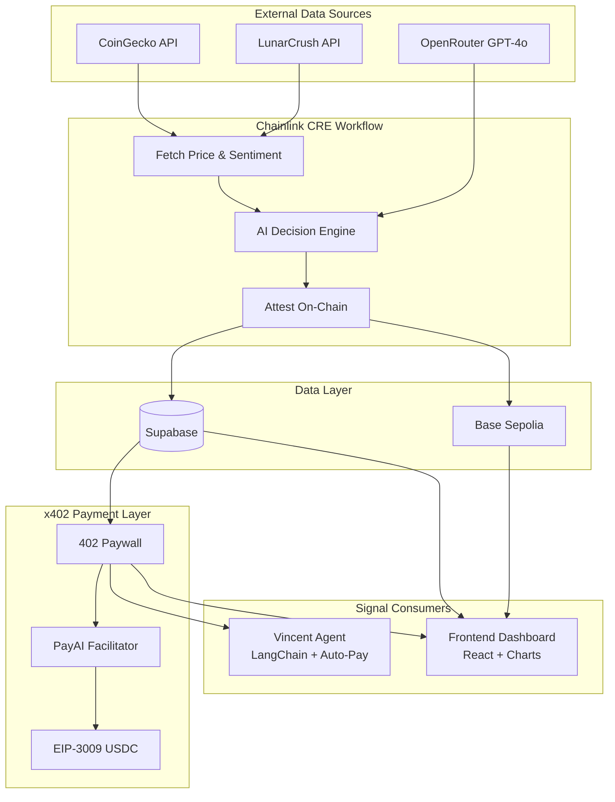

# Vincent - Autonomous AI Trading Agent with x402 Payments

[](https://docs.chain.link/cre)
[](https://x402.org)
[](https://base.org)

> **Chainlink CRE & AI Hackathon Submission**  
> Autonomous AI agents consuming CRE workflows with x402 payments

Vincent is a fully autonomous AI trading signal system that demonstrates the future of machine-to-machine commerce. It combines Chainlink's Compute Runtime Environment (CRE) for trustless signal generation with the x402 payment protocol for instant, permissionless API monetization.

## 🎯 Hackathon Use Case

**"AI agents consuming CRE workflows with x402 payments"**

This project showcases how AI agents can:
1. **Discover** payment requirements via HTTP 402
2. **Pay** autonomously using USDC on Base Sepolia
3. **Consume** CRE-generated trading signals
4. **Act** on signals with AI-powered decision making

No API keys. No subscriptions. Just autonomous, pay-per-request AI commerce.

## 🏗️ Architecture



See [ARCHITECTURE.md](./ARCHITECTURE.md) for detailed diagrams.

## 📁 Project Structure

```
vincent/
├── signal-attestator/          # Chainlink CRE Workflow
│   ├── signal-attestator/
│   │   ├── main.ts             # Workflow logic
│   │   ├── config.staging.json # Staging config
│   │   └── workflow.yaml       # CRE settings
│   ├── secrets.yaml            # Secret references
│   └── project.yaml            # CRE project config
│
├── x402-server/                # x402 Payment Server
│   ├── index.js                # Express + x402 middleware
│   ├── package.json            # Dependencies
│   └── .env.example            # Environment template
│
├── agent/                      # Autonomous AI Agent
│   ├── agent.py                # LangChain/LangGraph agent
│   ├── x402_client.py          # Python x402 client
│   ├── requirements.txt        # Python dependencies
│   └── run.sh                  # Launch script
│
├── frontend/                   # React Dashboard
│   ├── src/
│   │   ├── App.tsx             # Main dashboard
│   │   └── components/         # UI components
│   ├── package.json            # Dependencies
│   └── index.html              # Entry point
│
├── contracts/                  # Smart Contracts
│   └── src/SignalRegistry.sol  # On-chain attestation
│
├── ARCHITECTURE.md             # Mermaid diagrams
└── README.md                   # This file
```

## 🚀 Quick Start

### Prerequisites

- [Chainlink CRE CLI](https://docs.chain.link/cre) (`cre` command)
- Node.js 18+
- Python 3.10+
- pnpm or npm

### 1. Clone & Setup

```bash
git clone https://github.com/your-repo/vincent.git
cd vincent
```

### 2. Configure Environment

```bash
# Signal Attestator secrets
cp signal-attestator/.env.example signal-attestator/.env
# Add: OPENROUTER_API_KEY, SUPABASE_URL, SUPABASE_SERVICE_KEY

# x402 Server
cp x402-server/.env.example x402-server/.env
# Add: SUPABASE_URL, SUPABASE_SERVICE_KEY, X402_RECEIVER_ADDRESS, X402_PAYER_PRIVATE_KEY

# Agent
cp agent/.env.example agent/.env
# Add: OPENROUTER_API_KEY, PAYER_PRIVATE_KEY

# Frontend
cp frontend/.env.example frontend/.env
# Add: VITE_SUPABASE_URL, VITE_SUPABASE_ANON_KEY
```

### 3. Start Services

**Terminal 1: CRE Workflow (Signal Generation)**
```bash
cd signal-attestator
while true; do cre workflow simulate ./signal-attestator -T staging-settings; sleep 30; done
```

**Terminal 2: x402 Server (Payment Gateway)**
```bash
cd x402-server
npm install
node index.js
```

**Terminal 3: Autonomous Agent**
```bash
cd agent
./run.sh
```

**Terminal 4: Frontend Dashboard**
```bash
cd frontend
npm install
npm run dev
```

### 4. View Dashboard

Open http://localhost:5173 to see:
- Live trading signals for BTC, ETH, SOL
- Price charts with TradingView Lightweight Charts
- Agent activity monitor
- On-chain verification status

## 🔧 Key Components

### Chainlink CRE Workflow

The signal attestator workflow runs on Chainlink's Compute Runtime Environment:

```typescript
// Fetches price from CoinGecko
const price = await fetchPrice(asset);

// Fetches sentiment from LunarCrush
const sentiment = await fetchSentiment(asset);

// AI decision via OpenRouter
const decision = await callOpenRouter(price, sentiment);

// Attest on-chain
await submitToChain(decision);

// Store in Supabase
await submitToSupabase(decision);
```

### x402 Payment Protocol

The x402 server protects signal access with pay-per-request:

```javascript
// Payment middleware configuration
app.use(paymentMiddleware({
  "GET /api/signals": {
    accepts: [{
      scheme: "exact",
      price: "$0.01",
      network: "eip155:84532",  // Base Sepolia
      payTo: receiverAddress,
    }],
  },
}, resourceServer));
```

### Autonomous Agent

The Python agent uses LangChain with custom tools:

```python
@tool
def fetch_signals_with_payment():
    """Fetch signals via x402 payment using EIP-3009 USDC authorization"""
    # Automatic 402 detection → payment → retry
    response = httpx.get(paid_demo_url)
    return response.json()

@tool
def record_trading_decision(asset, action, reasoning):
    """Record AI trading decision"""
    agent_state.record_decision(asset, action, reasoning)
```

## 💰 Payment Flow

```
1. Agent requests /api/signals
2. Server returns HTTP 402 with payment requirements
3. Agent signs EIP-3009 USDC authorization
4. PayAI facilitator verifies & settles on Base Sepolia
5. Server returns signals
6. Agent analyzes & makes trading decisions
```

**Cost:** $0.01 USDC per signal fetch

## 🔗 Links

| Component | Technology | Documentation |
|-----------|------------|---------------|
| CRE Workflow | Chainlink CRE | [docs.chain.link/cre](https://docs.chain.link/cre) |
| Payments | x402 Protocol | [x402.org](https://x402.org) |
| Facilitator | PayAI | [docs.payai.network](https://docs.payai.network) |
| AI Agent | LangChain | [langchain.com](https://langchain.com) |
| Charts | Lightweight Charts | [tradingview.github.io/lightweight-charts](https://tradingview.github.io/lightweight-charts) |

## 📊 Tech Stack

- **Blockchain:** Base Sepolia, Foundry, Viem
- **Backend:** Chainlink CRE, Node.js, Express
- **Payments:** x402, EIP-3009, USDC, PayAI
- **AI:** OpenRouter (GPT-4o), LangChain, LangGraph
- **Frontend:** React 19, TailwindCSS 4, Lightweight Charts
- **Database:** Supabase (PostgreSQL)

## 🏆 Hackathon Criteria

| Criteria | Implementation |
|----------|----------------|
| ✅ Uses Chainlink CRE | Signal attestation workflow with on-chain verification |
| ✅ AI Agent Integration | LangChain agent with autonomous decision making |
| ✅ x402 Payments | Pay-per-request signal API with PayAI facilitator |
| ✅ Real USDC | EIP-3009 gasless transfers on Base Sepolia |
| ✅ End-to-End Demo | CRE → x402 → Agent → Dashboard |

## 📜 License

MIT

---

Built with 🤖 for the Chainlink CRE & AI Hackathon
